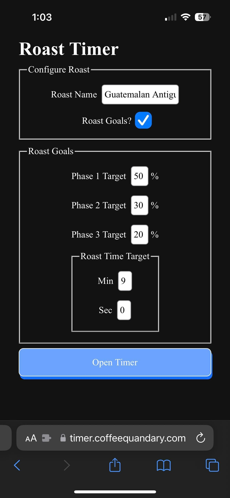

[Coffee Timer](https://timer.coffeequandary.com) is an app that helps home coffee roasters time and track the phases of their roast. It was designed mobile-first so that someone working with a popcorn popper, Hive, or FreshRoast could use it on their smartphone during the roast.

For coffee roasters, the more data the better during a roast. The ideal is to connect multiple sensors for heat, airflow, and the like to a roasting scope application like [Artisan](.md). Smaller home roasting devices don't usually come with sensors and connectivity out of the box, but by marking the times for the end of the dry phase and first crack, it's possible to map out the phases of the roast and their lengths. This data, combined with seeing how far the roast has progressed gives the roaster access to 80% of what they need to know during a roast.

Giving the user access to the majority of what they need to know by using a smartphone app during the roast was an attractive idea to my Dad and I when we started experimenting with air roasting (a FreshRoast SR800) as an aside to our usual drum roasting. We ended up landing on something that should be helpful fr other home roasters and has multiple avenues for potential expansion.

## Screenshots

## Features

- Name your roast
- Set a preferred roast profile in terms of phase-length (sensible default provided)
- Track phases as the roast is occuring and get a +/- between the elapsed time and your planned profile
- Roast results can be easily shared via screenshot
- Some PWA features enabled. Users can install the app on their home screen (tested on iOS).
- Large, 3D-ish buttons that include a small animation when depressed. Intended to be very easy to hit the button while roasting. Deisgn inspired by buttons in Duolingo.
- Distinct color schemes controlled by `prefers-color-scheme`

## Lessons Learned

### Screen Real-estate
With the the goal of trying to provide the most valuable 80% data, screen real-estate was a challege on the mobile form factor. Usually, roasting scope software is presented full-screen on a laptop or external monitor. I knew I wanted to show roast phase data in a table, but I needed to be very selective about which data I displayed and in what format. Using Emoji as descriptive table headers made it possible to fit 5 columns in the table. Only adding rows to the table once they were active allows the user to always glance at the very bottom row of the table to check information about the active phase.

### Typography
When I was protyping the app, I left the typography set at the default serif font of the browser (most likely Times New Roman). I planned on getting fancier with the typography later, but when my Dad saw the first version of the app, he commented that he liked the typeface. This was a good reminder that given the right size, kerning, and line spacing, fonts can really shine, even the browser defaults. I'm still not sure that the default serif font is the right choice for the body and forms, but I'm pretty happy with nice big serif numbers on the timer itself.