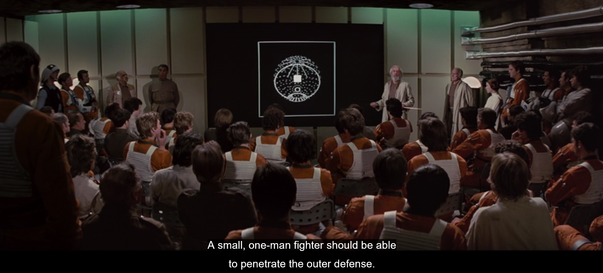

---  
share: true  
title: "On 10 Years of Making Software"  
description: "Thoughts and reflections about why I (still) love making software."  
date: 2022-11-30  
layout: article  
featured: true  
---  
up :: [∴ Software Development](./%E2%88%B4-Software-Development.md)  
tags :: #essay  
  
# On 10 Years of Making Software  
  
*This year I realized I am now 10 years into a career in making software. As I reflected on my experience thus far I began to see certain themes that continue to resonate with me in my work. The writing below is an attempt to explore those themes in the hope of better understanding my own motivations and what I should seek in the next phase of the journey.*  
  
As the point in time that I began **Making Software** moves farther and farther away, I oscillate between feeling as if it began a long time ago and as if it was yesterday. Surely though, much has changed in that time --- not only about me but about the world we all live and work in. When I started out in 2012, open offices were just washing ashore at the conservatively-cultured bank that I worked at. I was put on an **agile** scrum team of five developers along with a **QA** and a **Scrum Master**. We were _literally_ making a spreadsheet for the web. While learning to sling code in Java 6 I was fed a robust diet of methodological guidance both in theory and in practice. **TDD**, **Story Points**, **Sprints**, **Clean Code**. There were just as many new buzz words as experiences in those early months. I watched mustachioed, grown men passionately yell at groups of other humans about **ESB**s (Enterprise Service Bus... don't look it up). We strove to automate our deployments, bring agility to company culture, and iteratively deliver value to customers. The best days were a surreal mixture of science fiction, fantasy, and late 90s office decor. Sometimes when the developers would get together to solve a problem, I felt like an X-Wing pilot listening to General Dodonna's briefing as I was about to assault the Death Star.   
  
  
  
On the worst days, I often felt as though I had tasted the future (surely an **[../Cards/Agile](./Agile.md)** mindset could solve the problems besetting **IT** projects and society at large) but was held back by the red tape and stodgy outlooks of middle-management at the medium-sized regional bank where I held my employ.  
  
Much has changed since those days for me and others --- some of which might even be worth discussing. My goal here is to reflect on what it is about making software that I continue to find so enriching. Most of this is inextricably tied up in my own journey: the extremely helpful mentor I had early on, the insane situations I happened upon, the friends I made, the mistakes I committed, and the internal commitments, failures, fears, and strivings of my own fickle heart. Perhaps though, the themes here are deep enough that they are helpful to others for reflection as well.  
  
# Identity  
  
I'm able to trace my interest in computers and technology as far back as the 3rd grade. Sure, there was the glory of **Sega Genesis** that came before that, but what kid isn't in awe of video games? No, it was that time in the 3rd grade when every student was assigned a **Year-long project**. We were to select any subject we could think of. Then, periodically throughout the year, we were to do variety of research and projects related to that subject. At the end of the year there was a fair where all of the students displayed their work. I had no idea what subject to pick. My Father, in one of his famously creative and wise moments suggested --- with a smile on his face --- that I should study **The Internet**. I knew this had something to do with computers and that was enough, I said yes.   
  
Of the things I remember in the project a few are worth mentioning. It was 1998. We had 56k dial-up. My Dad took me to visit an **ISP**. At that time, our area had not yet succumbed relying on giant corporations for internet access. The ISP we visited was operated out of an old house by what appeared to be a single person. The only thing that I remembered about the visit is that the guy at the **ISP** asked me "would you like to see **The Internet**?". His question implied that if I could see it then I might possibly be able to understand what it was. My heart leapt and I was able to mumble something that sounded affirmative, so the man opened a closet in the house to reveal a rack of network switches with cables strewn about, all awash in the glow and flicker of LED lights. I likely just stared and drooled as he said things I didn't understand before closing the door. The encounter was characteristic of what would fuel my ongoing interest --- a combination of **Sci-Fi**, awe, wonder, not having any idea how the things that I was looking at were able to do what they did.  
  
For the finale of my **Year-long project**, I provided input to my Dad as he built a website for me complete with a page that described the things that I liked to do, a guestbook, and animated GIFs. It was hosted on **Angelfire** and created with [**NetObjects Fusion**](https://en.wikipedia.org/wiki/NetObjects_Fusion). The small glimpses of HTML that I got never full left my consciousness.  
  
Despite some very geeky moments early on though, I never thought I could be a programmer. There was too much mystique around it and I didn't have enough confidence in my own aptitude to think that I might be able to ever do that myself. For many years I got my kicks from reading **PC Gaming** magazine, spending whole summers downloading shareware games, and making my own software distribution that I gave to classmates. Of course, things changed significantly when I was put on a software development team for an 8-month rotation at one of my first jobs after undergrad.  
  
I was working at that conservative regional bank that I mentioned earlier. They had a program where they hired new grads and put them through three 8-month rotations in different departments of the IT organization before placing them somewhere permanently. As I said before, I never thought I could be a programmer, but the kind HR rep told me on my first day that I was being placed on an **Agile** software development team for my first 8 months and my only goal was to learn. The open-ended goal, my 20 years of accumulated curiosity, and the mentor I was assigned were enough to get over the confidence hump and find joy in making software.  
  
I quickly fell in love with being on a team of geeks, trying to figure out what to build as we built it. There was a sort of geek religion that we all observed in that open office. The great Sci-Fi films were our Old Testament and **Clean Code** was our New Testament. Like any good religious community we debated solutions to the problem of evil and the ever-prescient issue of how to practice our daily liturgies (let the reader understand: **Vim** vs. **Emacs**). The deed was done and I was now to do this work professionally.  
  
# The Nature of the Work  
  
There are two sides to the coin of **Making Software** that acted in tandem to bring me to full devotion. First, there are worlds upon worlds of abstractions, architecture, tools, methods, and patterns that one can get lost in. I call this part of the work **Engineering**. Second, there is the harder-to-describe work of understanding your users, their world, and bringing your skills to bear upon their problems. I use the term **Development** for this part of the work. At their best, these seemingly disparate disciplines interplay healthily and produce an emergent effect that I think of as  **Craftsmanship**. The first two are what one spends their time on. The latter becomes **The Infinite Game**.  
  
## Engineering  
Early on in my 8 months with the **Agile** software development team, someone walked me through the codebase of an app that an adjacent team had been working on. It was built with **Spring MVC**. At that point I had never of MVC before, so it was really an exercise in explaining the difference between the front-end, the back-end, how the controllers interacted with models, etc... I remember that just being shown how the different layers of abstraction handled different concerns and were composed was exciting. There is a thrill in seeing how something works. I think for people like me who's formative years were less connected with nature and using one's hands to make something, there is a way in which this type of engineering is fulfilling. It's also an escape. There are entire technical worlds to get lost in. One's present social issues can fade in the background when you're comparing architectural approaches or ways to represent your data.  
  
Some people probably live more fully in the world if **Engineering** than I do. For me, it's an (interesting) means to the end of providing value in the real word.   
  
## Development  
I think of a software project as an endeavor to create a product. We start a diverse set of problems, ideas, research, analyses, and hunches. Over time the team processes those raw materials into a new creation --- a semi-tangible system or product is brought into existence. And now, this new thing invites users into an experience or encounter that is perhaps somewhat unique from all that existed before it. It may solve a problem or only exist as a means to enrichment. Discovering what to make is the journey and the moments of joy or adventure along the way usually make it worth the price of admission.  
  
The goal of **Development** is of course to produce something valuable. In my experience though, we tend to underestimate the value that is inherent of the journey itself. In some cases, the value provided to the business is just as much in the understanding that comes from trying to figure out what build as it is in the result itself. Software often has to codify processes and practices that may have been implicit until now. **Making Software** requires us to understand the process and transform them. Beyond merely identifiying a process, digitizing a process actually forces us to change how it works. Richard Hamming summarizes this well. He's comparing aspects of the industrial revolution to the digital revolution:  
  
> Indeed, one of the major items in the conversion from hand to machine production is the imaginative redesign of the *equivalent product*. Thus in thinking of mechanizing a large organization, it won't work if you try to keep things in detail exactly the same, rather there must be a larger give and take if there is to be a significant success. **You must get the essentials of the job in mind and then design the mechanization to do that job rather than trying to mechanize the current version --- if you want a significant success in the long run**.[^1]  
  
[^1]: Hamming, Richard. *The Art of Doing Science and Engineering: Learning to Learn*. Stripe Press, p. 19  
  
Making software is a process that forces people to learn about the nature of a thing in the real world to the point where they can created a digital experience that interfaces with reality. Learning about the nature of a thing and representing it --- even improving it --- are skills in their own right. **Making Software** as a means of learning and discovery is renewable motivational fuel for me. I suppose that's why I keep moving towards working in domains that I'm personally interested in.  
  
## Craft  
  
I then think of **Craft** as a property that emerges from the **Engineering** and **Development** disciplines. There is a thrill in the **Engineering** and a joy in the **Development**. When rightly held together I find that care, pride, enjoyment, and beauty begin to inform the way that I work.  
  
### Make it work, make it right, make it beautiful  
  
Due to the influence of those I was working with, I learned early on that **Making it work** is really just the first step of an engineering process. After it works it is just as important **Make it right**. In those early days I remember spending whole afternoons finding the *right* way to implement something long after we had it working. This was likely when I first caught a whiff of **Craft**. The programmer who is finished when it *works* has stopped short. There are limitless ways to implement something but some implementations are objectively worse than others once you start thinking about scaling, maintainability, and (gasp!) beauty. When I started caring about being able to do the work rather than progressing my career --- when I started finding systems, code, and my tools beautiful --- that's when **Craft** had emerged. Now admittedly, my sense of aesthetics related to being a programmer is somewhat intense compared to that of others. I remember a season when I was almost exclusively writing CoffeeScript in Vim --- unicode that rolled off my fingers into my modal editor was so terse and expressive that it seemed to be valuable in and of itself. More than once I felt more like a poet than a programmer in that season.  
  
**Craft** is about more than aesthetics though. When it takes hold you find a strange commitment within yourself to the work. The concept of **The Long Road** characterizes this well:  
  
> People aspiring to become masters of software craftsmanship need to plan for the long term. This long (yet bright) journey will bring you a rich set of abilities. You will become skilled at learning, problem solving, and developing strong relationships with your customers. You will come to wield knowledge and technology as the samurai uses his short and long swords. You will come to comprehend and appreciate the deeper truths of software development. But all this will take time.  
>   
> You should be prepared for the length of this journey... you should keep in mind the expectation that you will be a working software developer even when you are middle-aged. Let this influence the jobs you take and the scope of your ambitions. If you’re still going to be working in 20 years’ time, then you can do anything. No one is so far ahead that you can’t match their skill level given the decades you will have to hone your craft. No business or technical domain is closed to you... rather than counting the days to retirement, the craftsman will willingly and joyfully work into her final decades.[^2]  
  
[^2]: Hoover, Dave and Oshineye, Adewale. *Apprenticeship Patterns: Guidance for the Aspiring Software Craftsman*. O'Reilly, 2010. p. 39  
  
# Creating  
From a philosophical point of view, I believe "there's nothing new, only fresh ways of combining old stuff."[^3] As creatures ourselves everything we can do is derivative of the creation itself in some way that is impossible to disentangle. When **Making Software** though, there is sometimes and undeniable sensation that not only is something being created or born in front of our eyes, but that we are a part of that process. Whether derivative or not, that sensation can be exhilarating.  
  
[^3](and%20not%20just%20in%20music)%20gets%20it%20wrong%20by%20telling%20to%20the%20students%20to%20%22be%20themselves.%22%20There's%20nothing%20new,%20only%20fresh%20ways%20of%20combining%20old%20stuff.%20If%20you%20are%20in%20an%20academic%20environment,%20students%20should%20just%20go%20to%20the%20library%20a%20lot%22%20*Twitter*.%203%20December,%202022,%20Link.md)  
  
At its best, this amounts to sense of mystery and wonder while one does the work --- watching something be created from (seemingly) nothing all while not knowing how the experience will unfold. In what some considered a stuffy office job --- surrounded by geeks, ugly office decor, and sub-par coffee ---  there is to be found creativity, joy, hope, expectation, uncertainty, and delight. And what makes **Making Software** *the best* is that when wielded carefully, these delights can be accessed almost daily. Early on I was stuck by an excerpt from Frederick Brooks (emphasis mine) that captures what it can be like:  
  
> As the child delights in his mud pie, so the adult enjoys building things, especially things of his own design. I think this delight must be an image of God's delight in making things, a delight shown in the distinctiveness of each leaf and each snowflake...  
>   
> The programmer, like the poet, works only slightly removed from pure thought-stuff. **_He builds his castles in the air, from air, creating by exertion of the imagination._** Few media of creation are so flexible, so easy to polish and rework, so readily capable of realizing grand conceptual structures... Yet the program construct, unlike the poet's words, is real in the sense that it moves and works, producing visible outputs separately from the construct itself. It prints results, draws pictures, produces sounds, moves arms. **_The magic of myth and legend has come true in our time. One types the correct incantation on a keyboard, and a display screen comes to life, showing things that never were nor could be._**[^4]   
>   
> *Fred Brooks, The Mythical Man-Month: Essays on Software Engineering*  
  
[^4] Brooks, Frederick P., Jr., *The Mythical Man-Month: Essays on Software Engineering*. Addison-Wesley, 1982.  
  
In my early months at my first gig, I watched as our team discovered what we should build and how we should build it _as we were building it._ My mentor showed me both in microcosm and macrocosm that one often has to make something in order to figure out what should be made. This discovery by way of making was fractal -- that is, it appeared at every granularity of the project. Out of thin air I watched the castle be designed and built simultaneously and I was one of the wizards doing it, all while surrounded by post-it notes, aging Herman-Miller chairs, and bad coffee (have I mentioned the coffee was *really* bad?). Working like a wizard while surrounded by people who thought it was just as much fun as I did? Surely, I had stumbled upon some sort of secret life cheat code that enabled work to be fun and delightful.  
  
# Craving  
  
Outside of **Identity**, **The Nature of the Work** and **Creating**, there is at least one more category of experience that is worth talking about. When one is engrossed in the work, there is another plane of delight that intersects with these other categories. This final experience is very circular. It's something akin to a machine whose purpose is to create fuel for itself. It's a regenerative motivation that creates... motivation. As we create we are enmeshed in [rhythms of tension and release](https://www.geepawhill.org/2019/11/15/ramps-rhythm-is-tension-and-release/). We create tension when we write some code not knowing if it will do what we want it to. The release comes when it works. Sometimes we stack tension upon tension to get a hit of combines releases. As GeePawHill explains[^5] humans exploit this sort of rhythm in music, TV show plotlines, and more.  
  
[^5]:  See [RAMPS - Rhyhm is Tention and Release](https://www.geepawhill.org/2019/11/15/ramps-rhythm-is-tension-and-release/). *Rhythm* is one of the [five](https://www.geepawhill.org/2017/09/05/a-sense-of-urgency-ramps-as-a-motivation-model/) "drives" that he identifies as essential for motivation.  
  
From my earliest moments as a software developer I remember experiencing these concentric cycles of tension and release. Take for instance the one actual programming class that I had in school,  **Java Software Development for Business Majors**. Even in taking the class there was an immediate onset of tension. Externally, there were the swirling rumors that this was a class that many before had failed. The professor was teaching remotely this semester and would mostly just give assignments on a glorified piece of forum software. I was but one of 30 or so non-programmer guppies taking the class, surely I wouldn't get much help from my classmates. Internally, I had a lifelong interest in computers and the internet, but never felt as though I was smart enough to be a programmer. In light of all this, would I be able to teach myself to program to avoid failing the course, my schooling, and surely life? The tension was palpable. Just as palpable as the tension though, were those moments of resolution -- getting a bit of code to *compile* and consequently not feeling like failure in the moments before the flash of joy subsided. I often wondered if programming worked like an addiction for me. Each cycle of tension and resolution only led to a greater anticipation of the next.  
  
I learned that going through the gauntlet of **getting something to work** involved a loop of tension and release that seemed to engender the desire for another, perhaps larger loop. **Making Software** was a chase of some sort filled with miniature instances of these tension and release loops. I find that when I can get properly plugged into a task or solving a problem, **Space-Time** itself melts away as I focusing on reaching solution. As I write code, loops of tension are opened and it's my job to close them. When I do get there, it all just makes me want to do it again. Shepherding these cycles is likely a very important for sustained motivation and productivity but it's also just really enjoyable. Some of the moments that remain most fond to me are when the time available in an afternoon seemingly evaporates as I enter flow -- letting go of almost all my other cares --- to load up the problem and the system into mental RAM and cravingly chase the solution. In all my feeble encounters with the humanities, one that has stuck with me is T.S. Elliot's reflections on **Time** in *Burnt Norton*:  
  
> Time past and time future   
> Allow but a little consciousness.    
> To be conscious is not to be in time[^6]  
  
[^6]: Eliot, T. S. Four Quartets. New York, Harcourt, Brace and Co, 1943.  
  
The craving pursuit of **Making it work** is often journey into the act of creating so deep that one becomes conscious and therefore exits time, for a time.   
